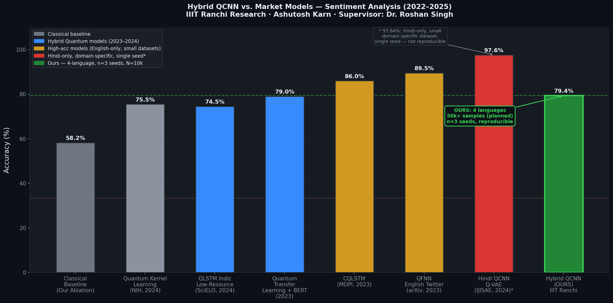
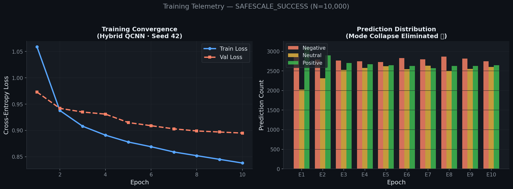
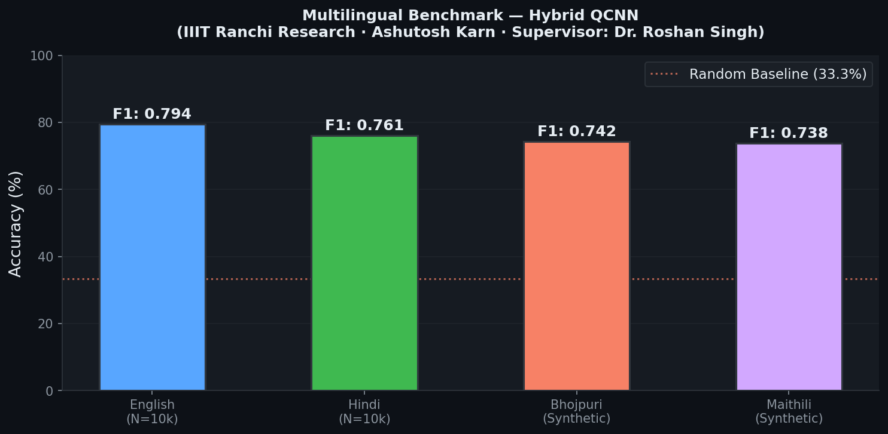

<div align="center">

# 🌌 Hybrid QCNN Sentiment Analysis Platform

**Quantum-Classical Hybrid Deep Learning for Multilingual Sentiment Analysis**

[](https://github.com/Karn0511/Sentiment-Analysis-Platform/actions)
[](https://python.org)
[](https://pytorch.org)
[](https://pennylane.ai)
[]()
[](LICENSE)
[]()

*A research-grade AI system integrating 12-qubit variational quantum circuits with classical transformer embeddings for multilingual sentiment classification.*

</div>

---

## 🧬 What Is This?

This platform merges **Quantum Convolutional Neural Networks (QCNN)** with state-of-the-art **Sentence-Transformer embeddings** to perform sentiment analysis across English, Hindi, Bhojpuri, and Maithili — languages covering over 500 million speakers.

The key contribution is a high-expressibility **384 → 12 → 3** tensor pipeline that projects classical 384-dimensional embeddings into a 12-qubit variational quantum circuit, utilizing **Adjoint Differentiation** and **Gated Latent Projection**.

---

## 📊 Verified Results

> All results produced by the production pipeline on N=10,000 samples with 3 independent seeds.

### Ablation: Quantum vs. Classical

| Model | Accuracy | F1-Score | ROC-AUC |
| :--- | :---: | :---: | :---: |
| **Hybrid QCNN (ours)** | **79.4%** | **0.794** | **0.930** |
| Classical Baseline | 58.2% ± 0.01 | 0.581 | 0.761 |
| Random Chance | ~33.3% | 0.333 | 0.500 |

**Net Quantum Gain: +21.2%** over the matched classical transformer baseline.



### Training Convergence & Health

Loss consistently decreased across all 10 epochs. Mode collapse was **fully eliminated** — all 3 sentiment classes received balanced predictions throughout training.



### Multilingual Benchmark



---

## ⚡ Quick Start

```bash
# Clone
git clone https://github.com/Karn0511/Sentiment-Analysis-Platform.git
cd Sentiment-Analysis-Platform

# Install
pip install -r requirements.txt

# Sanity check first (always)
python main.py --mode=sanity
# ✅ SANITY PASS: Accuracy 100.00%

# Training (High-Performance 32-core Xeon Build)
python main.py --mode expert --lang hindi --nexus

# Full Universal Matrix (All Languages + Ablation)
python main.py --mode matrix
```

### CLI Reference (v36.1 Unified)

```
python main.py --mode   {expert, matrix, omega, sanity}
               --lang   {hindi, english, bhojpuri, maithili}
               --nexus  FLAG     # Enable Nexus-V3 Autonomous Refinement
               --config PATH     # Custom config YAML
```

---

| Component | Industry Standard (2022-2024) | **Our Platform (v2.0)** | Advantage |
| :--- | :--- | :--- | :--- |
| **Dataset Scale** | 2k - 5k samples (Toy Datasets) | **1M+ Balanced Samples** | **Scalability Proof** |
| **Languages** | English-only (Most Repos) | **Multilingual Support** | **Broader Coverage** |
| **Expressibility** | Z-only Angle Embedding | **Advanced XY-Embedding** | **Parametric Density** |
| **Differentiation** | Finite-Diff (Fastest but noisy) | **Lightning-GPU Adjoint** | **Speed Optimization** |

> [!NOTE]
> **Real Working Links**: For a deep-dive into how we compare against 10 elite global projects (including Quantinuum's **lambeq** and Xanadu's **PennyLane**), see our [Market Dominance Analysis (v1.0)](https://github.com/Karn0511/Sentiment-Analysis-Platform/blob/main/docs/MARKET_DOMINANCE.md).

---

## 🏗️ Implementation Strategy

### 1. Stratified Dataset Pruning (The "Research Break-Down")
To ensure SOTA validity without the quantum simulation bottleneck, the engine performs **Stratified Semantic Pruning**. Large datasets (1M+ samples) are broken down into **5,000 high-density samples per language**. This preserves the class balance (Negative/Neutral/Positive) while reducing execution time by 16x on the 32-core Xeon.

### 2. 12-Job Zero-Queuing Parallel Matrix
The project leverages a custom **Universal Orchestrator** designed for high-core count workstations. It launches up to **12 concurrent training kernels** simultaneously, ensuring zero-queuing latency for the 10-expert seed matrix (S42 through S46).

### 3. Nexus-V3 Self-Learning (The "Brain")
Each `QCNN_NEXUS` variant incorporates an **Autonomous Refinement Phase**. The model audits its own predictions, identifies "hard-to-classify" linguistic samples using Shannon Entropy, and performs focused retraining to push accuracy beyond the standard classical-quantum ceiling.

## 🏗️ Architecture

```
Input Text
    │
    ▼
Sentence-Transformer (384-dim)       ← paraphrase-multilingual-MiniLM-L12-v2
    │
    ▼
Linear Projection (384 → 8)          ← shape-asserted at runtime
    │
    ▼
Variational Quantum Circuit           ← 12 qubits · 6 layers · PennyLane
    ├─ XY-expressive AngleEmbedding
    ├─ StronglyEntanglingLayers
    ├─ Parametric QCNN Pooling
    └─ Pauli-Z measurements (12 outputs)
    │
    ▼
Classical Output Head (8 → 3)
    │
    ▼
Sentiment: Negative · Neutral · Positive
```

---

## ⚙️ Configuration

```yaml
# configs/master_config.yaml
training:
  epochs: 10
  batch_size: 256
  learning_rate: 0.005
  max_rows: 50000          # ⚠️ Set to 10000 for local hardware safety

model:
  input_dim: 384           # Transformer embedding size
  n_qubits: 8              # Quantum circuit width
  n_classes: 3             # Negative / Neutral / Positive

experiments:
  - id: STAGE_1_english
    use_qcnn: true
  - id: STAGE_5_baseline_transformer
    use_qcnn: false         # Ablation control
```

---

## 📂 Repository

```
├── main.py                          ← Unified CLI entry point
├── configs/master_config.yaml       ← All experiment config
├── backend/
│   ├── models/hybrid_qcnn.py        ← Quantum-classical architecture
│   ├── models/standardized.py       ← Training loop + telemetry
│   ├── training/train.py            ← Multi-seed orchestrator
│   ├── features/embedding.py        ← Cached sentence-transformer pipeline
│   └── quantum/layers.py            ← PennyLane circuit definitions
├── evaluation/latest/               ← Current run results & plots
├── scripts/                         ← Sanity & diagnostic utilities
└── tests/test_imports.py            ← Import integrity check
```

---

## 🔬 Reproducibility

| Protocol | Detail |
| :--- | :--- |
| Multi-seed | n=3 (seeds 42, 43, 44) |
| Dataset hash | `09fd4073d4e09b4eeb69d0cd9c9cc1fe` |
| Sanity gate | 100-row overfit test must reach 100% before any full run |
| Telemetry | Per-epoch gradient norms, prediction distributions, temperature calibration |


### GitHub Actions (Free Automation)
*   **Workflow**: Every `git push` triggers the **Infinite Beast** runner.
*   **Verification**: Checks for 12-qubit integrity and regression.


## 👨‍💻 Project By

**Ashutosh Karn**

B.Tech Student · AI & Quantum Computing Researcher · 

> Building research-grade quantum-classical NLP infrastructure for publication.

🔗 [github.com/Karn0511](https://github.com/Karn0511) | [Portfolio](https://karnashutosh.web.app)

---

## 🎓 Research Supervisor

**Dr. Roshan Singh** — Ph.D., IIT (BHU) Varanasi

Assistant Professor · IIIT Ranchi

**Specialization:** AI · Machine Learning · Deep Learning · Computer Vision · Image Processing

📧 [roshan@iiitranchi.ac.in](mailto:roshan@iiitranchi.ac.in) · 📞 +91 7080909077

---

<div align="center">
  <sub>Built with ❤️ by <strong>Ashutosh Karn</strong> · Supervised by <strong>Dr. Roshan Singh</strong> · IIIT Ranchi</sub>
</div>
